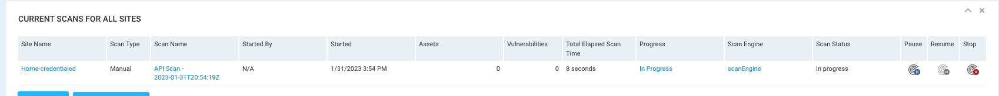

# Scan Site Script

## Description

Script name : **run-scan.rb**

Script that runs a scan against a specified site id.  In this example, the engine id and ip range to scan is hard coded into the script - but this could be easily modified to accept that information as input.
This is example code, intended to give user a starting point which they can build off of to fit the need of their environment.
Output shows the scan id that was launched as well as current status of the scan, if all was successful, it should show as running.  Confirmation can be seen from the console user interface - you should see a running scan much like the following picture:

## Installation

Copy script out to machine that has ruby installed and that also has network connectivity to the Nexpose console being queried.
Set execute permission on script.
> chmod 700 ./run-scan.rb

Script uses the following gems, make sure these are installed on the system used to run the script.
     time
     highline
     httparty
     json

## Usage

Script will prompt user for the following information :
     console IP:  enter ip address of Nexpose console
     username:  enter user name used to login to Nexpose console
     password:  enter password of user id of Nexpose console
     site ID:  The site id number that you wish to use for the scan.  Be sure that the scan range is applicable to the site.
To run:
./run-scan.rb  
Enter the server name (host) for Nexpose: |<console_ip_address>|  
Enter your username:  |username|  
Enter your password: \*\*\*\*\*\*\*\*  
Enter the site id: |5|

The scan id is 79 and its status is running
